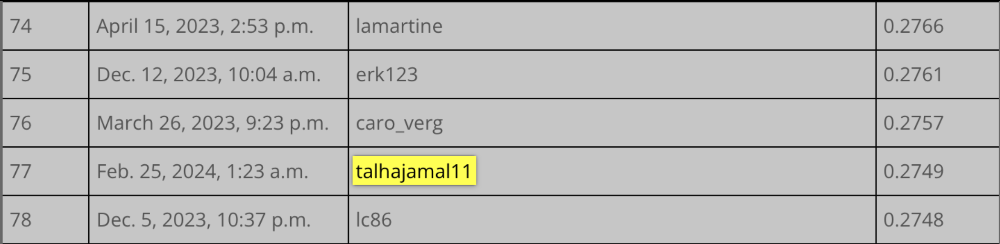

# QRT - Electricity Prices - 2023

- This Project tackled the problem of predicting the change in Electricity Prices.
- This Project is a competition sponsored by Qube Research Technologies.
- The Details of the competition can be found here: https://challengedata.ens.fr/participants/challenges/97/
- 6 Machine Learning Models were used and tested on Out of Sample Data. 
- The Best Performance was by a LightGBM Model that resulted with a Score Metric of 27.49% Spearman Rank Correlation. 
- This Score put the team's position at 77 out of total global submissions of 866 individuals and teams. 

  

## Challenge Context

Every day, a multitude of factors impact the price of electricity. These factors can vary from local weather conditions affecting electricity generation and demand to long-term phenomena like global warming. Geopolitical events, such as the war in Ukraine, may also influence the price of commodities, which are critical inputs in electricity generation. Additionally, each country relies on a unique energy mix, which can include nuclear, solar, hydro, gas, coal, and more.

Moreover, countries may engage in the import and export of electricity with their neighbors through dynamic markets, particularly in regions like Europe. These complex and interrelated elements contribute to the challenging task of modeling electricity prices within a given country.

Understanding and predicting these price fluctuations is essential for various stakeholders in the energy sector, including consumers, producers, and policymakers.

## Challenge Goals

The primary objective of this project is to model electricity prices based on various factors, including weather conditions, energy (commodity) data, and commercial data for two European countries: France and Germany. It is important to note that the focus of this challenge is on explaining electricity prices using multiple variables rather than predicting future prices.

Specifically, the challenge aims to develop a model that can accurately estimate the daily price variation of electricity futures contracts in France and Germany. Electricity futures contracts allow individuals and entities to buy or sell a specified amount of electricity at a predetermined price, with delivery occurring at a specified time in the future (at the contract's maturity). These contracts are essential financial instruments that provide insights into the expected future price of electricity under current market conditions, with a particular emphasis on short-term maturity contracts (24 hours). It's worth highlighting that the electricity futures exchange is a dynamic and evolving market in Europe.

Participants in this challenge have access to daily data for both countries, including quantitative weather measurements (such as temperature, rain, and wind), information on energy production (commodity price changes), and electricity usage data (consumption, cross-border exchanges between the two countries, and import-export activities with the rest of Europe).

The evaluation metric used in this challenge is the Spearman's correlation, which measures the strength and direction of the monotonic relationship between the participants' model outputs and the actual daily price changes observed in the testing dataset.

For more detailed information about the challenge and to engage with the community, please feel free to visit our dedicated forum and LinkedIn page.

## Data Description

This challenge provides three CSV file datasets: training inputs (`X_train`), training outputs (`Y_train`), and test inputs (`X_test`).

**Note**: The input data `X_train` and `X_test` represent the same explanatory variables but over two different time periods.

The columns `ID` in `X_train` and `Y_train` are identical, and the same holds true for the testing data. There are 1,494 rows available for the training datasets, while 654 observations are used for the test datasets.

### Input Data Sets

The input data sets comprise 35 columns:

- `ID`: Unique row identifier, associated with a day (`DAY_ID`) and a country (`COUNTRY`).
- `DAY_ID`: Day identifier - dates have been anonymized, but all data corresponding to a specific day is consistent.
- `COUNTRY`: Country identifier - `DE` = Germany, `FR` = France.

Following these identifiers, the data includes daily commodity price variations:

- `GAS_RET`: European gas.
- `COAL_RET`: European coal.
- `CARBON_RET`: Carbon emissions futures.

Next, there are weather measures (daily, in the country `x`):

- `x_TEMP`: Temperature.
- `x_RAIN`: Rainfall.
- `x_WIND`: Wind.

Following weather measures, the data includes energy production measures (daily, in the country `x`):

- `x_GAS`: Natural gas.
- `x_COAL`: Hard coal.
- `x_HYDRO`: Hydro reservoir.
- `x_NUCLEAR`: Daily nuclear production.
- `x_SOLAR`: Photovoltaic.
- `x_WINDPOW`: Wind power.
- `x_LIGNITE`: Lignite.

Finally, there are electricity use metrics (daily, in the country `x`):

- `x_CONSUMPTION`: Total electricity consumption.
- `x_RESIDUAL_LOAD`: Electricity consumption after using all renewable energies.
- `x_NET_IMPORT`: Imported electricity from Europe.
- `x_NET_EXPORT`: Exported electricity to Europe.
- `DE_FR_EXCHANGE`: Total daily electricity exchange between Germany and France.
- `FR_DE_EXCHANGE`: Total daily electricity exchange between France and Germany.

### Output Data Sets

Output data sets are composed of two columns:

- `ID`: Unique row identifier - corresponding to the input identifiers.
- `TARGET`: Daily price variation for futures of 24-hour electricity baseload.

The solution files submitted by participants shall follow this output data set format, containing two columns, `ID` and `TARGET`, where the `ID` values correspond to those of the `ID` column in `X_test`. An example of a submission file containing random predictions is provided - see also the notebook in the supplementary material section for the benchmark output.